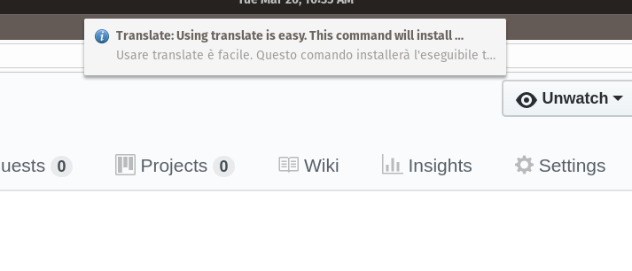

# Installation

Using translate is easy. This command will install the translate executable

    go get -u github.com/hankmartinez/translate/translate

# Example from help

Multiple args are joined in a single phrase to translate 

    a simple cli for translation from google.
    
    Usage:
       [flags]
    
    Flags:
      -h, --help        help for this command
          --sl string   source language (default "en")
          --tl string   target language (default "it")  
          
    translate Hello My Friend -> Ciao amico    
    translate --tl ru Hello My Friend -> Привет мой друг

# System 'Notify' (linux)
In conjunction with [xsel](https://github.com/kfish/xsel) you can set up a simple shell script
called by keyboard shortcut
    
    #!/bin/bash
    SELECTION=$(xsel -o)
    notify-send --icon=info "Translate: $SELECTION" "$(translate $SELECTION)"
    
The result:

